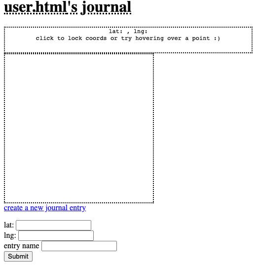

# Journal
Using tegola.io API, we retrieve longitudinal and latitudinal coordinates from a map server and are able to enter an journal entry based on those coordinates

## Bugs
Unfortunately, the server broke and is unable to run the map currently

## Demo
The map is supposed to be appear in the dashed box below

